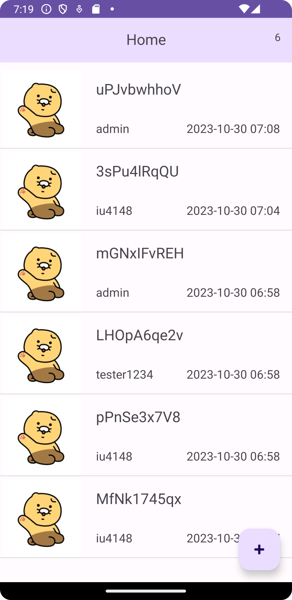
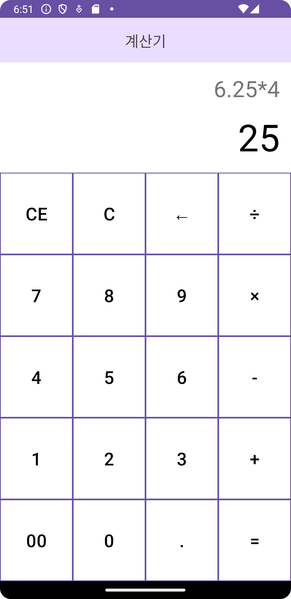

# Kotlin Practice Project
Newest version of Kotlin practice 

# Environment
Android Studio Giraffe | 2022.3.1 Patch 2  
Build #AI-223.8836.35.2231.10811636, built on September 15, 2023  
Runtime version: 17.0.6+0-b2043.56-10027231 amd64  
VM: OpenJDK 64-Bit Server VM by JetBrains s.r.o.  
Windows 11 10.0  
GC: G1 Young Generation, G1 Old Generation  
Memory: 1280M  
Cores: 16  
Registry:  
external.system.auto.import.disabled=true  
ide.text.editor.with.preview.show.floating.toolbar=false  

# Preview
Trading Stuff App using sharedpreference 

 
Calculator

